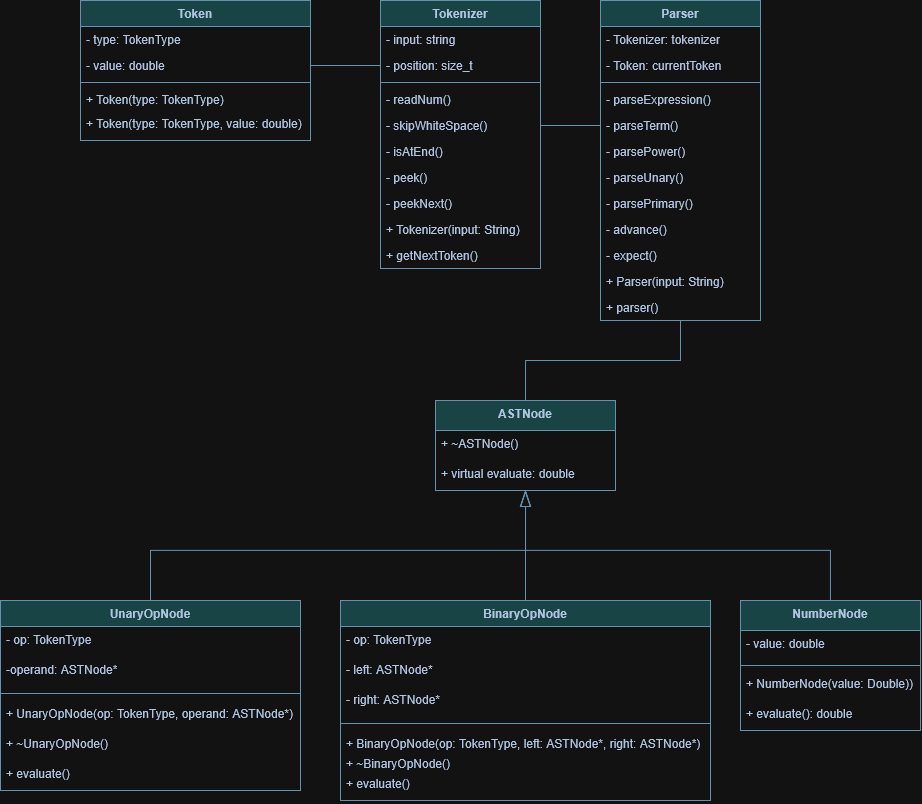

## Arithmetic Expression Evaluator (C++)

A command-line C++ program that evaluates arithmetic expressions.
It supports standard and unary operators while following correct PEMDAS precedence.

### Features 
- Supported operators:
    - `+` addition
    - `-` subtraction
    - `*` multiplication
    - `/` division
    - `%` modulo
    - `**` exponentiation
    - `()` Parentheses
    - `+`, `-` Unary operators

- Error handling:
    - Invalid expressions
    - Division by zero
    - Malformed numbers

---

## How it works

1. Tokenizer
    - Breaks apart an input string into tokens 
        - TokenTypes: numbers, operators, parentheses.
    
2. Parser
    - Uses tokens to recursively build an Abstract Syntax Tree (AST)

3. Evaluation
    - Recursively evaluates the AST.
    
---

## Project Structure
```
.
├── include
├── src
├── test
├── Makefile
└── ReadMe
```
---

## Build Instructions

From project root:
```bash
make
```

## Run Program
```bash
./build/evaluator
```

Enter an expression.
```
10 * 2 / 5
```

Output:
```
4
```

## Example Expressions:
| Expression | Result |
|-|-|
| `5 + 10 * 3` | 35 |
| `5 + 10 * 3 - 20 / 2` | 25 |
| `-(-10) + 6 + -6 * -2` | 28 |

## Eample Errors

| Expression | Error |
|-|-|
| `10 / 0` | Division by zero |
| `(25 + 6 - 3` | Unmatched parentheses |
| `1.3.25` | Malformed number |
| `* 10 + 6` | Invalid syntax |

## System Design


---